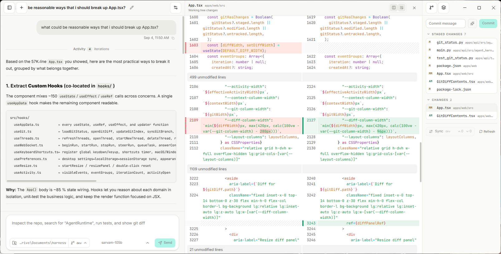

# AI Agent Harness

A desktop coding-agent harness for Windows and Linux, built with Electron, React, and FastAPI.

AI Agent Harness is supported only as a desktop application. The web project in this repository is the Electron renderer and is not intended to be run or deployed as a standalone web application.



## Desktop development

```bash
npm install
uv sync --all-packages --all-groups
npm run build:web
npm --workspace apps/desktop start
```

Electron starts and authenticates the local FastAPI backend automatically and uses the repository as its default workspace in development. Rebuild the renderer with `npm run build:web` after UI changes.

## Verify and package

```bash
npm run test:api
npm run test:desktop
npm run typecheck:web
npm run package:desktop
npm run smoke:packaged
```

Local packages are written to `apps/desktop/release`. Before tagging, set the shared version, for example with `npm run version:set -- 1.2.3`; matching version tags trigger the Windows x64 and Linux x64 release builds.
